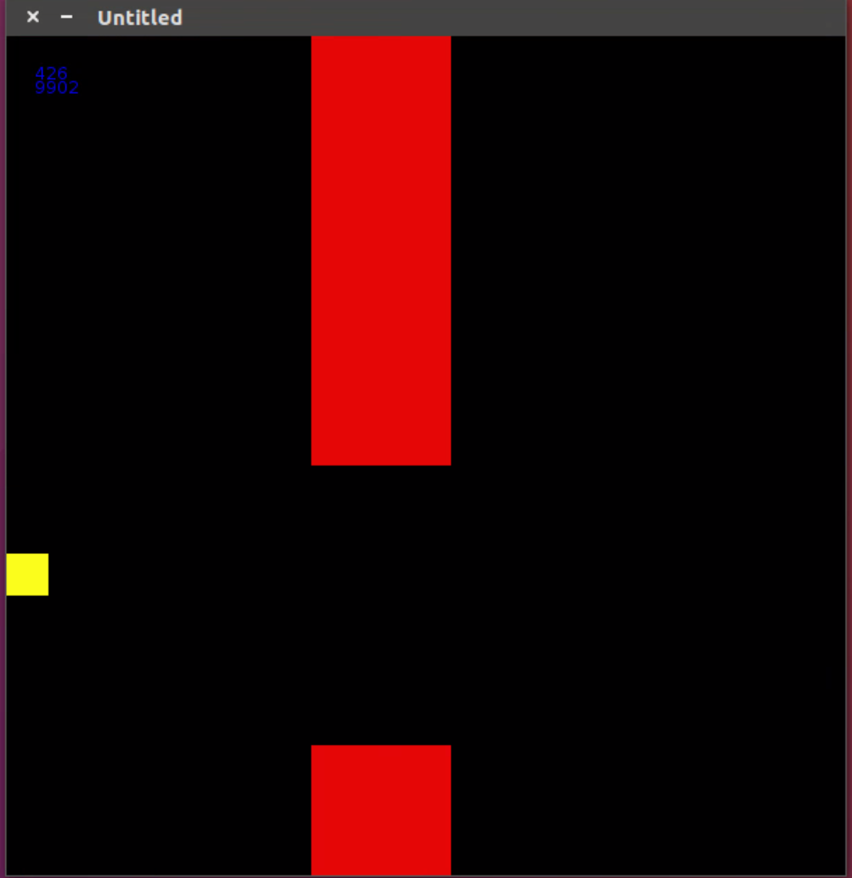

# hirerachical reinforcement learning system

This simple simulation environment is made by love2d, deep neural network is implemented by torch.
This simulation is a simplified version of autonomous driving task.

- high level path planning( deep Q learner )
- low level target tracking( ADP learner )

sample result

